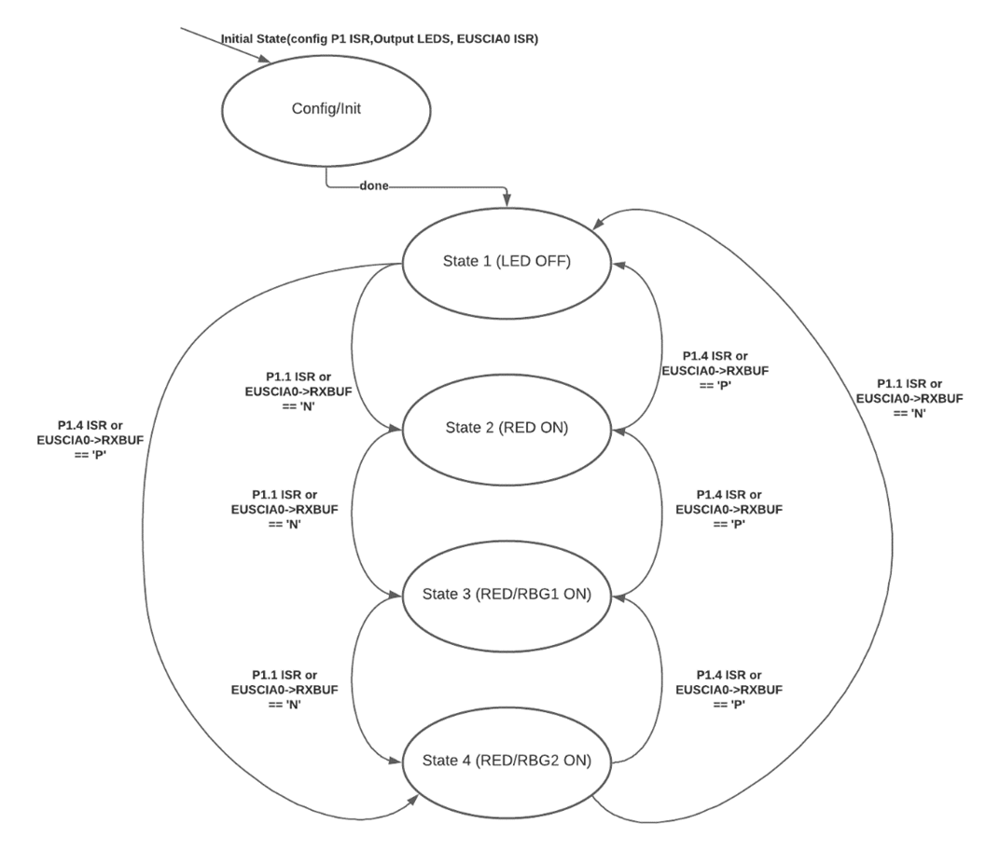

# Monitoring Application
An application to monitor a state machine from an embedded board using C and PySerial. The board is programmed using embedded C code and then can communicate with the application using the UART protocol. 

